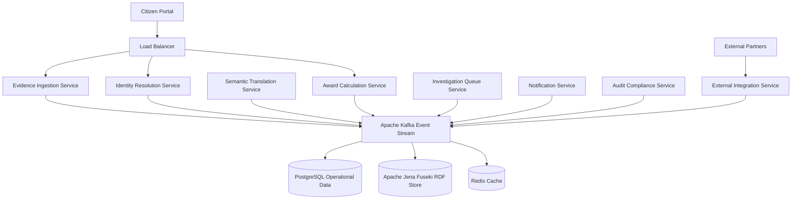

# Appendix A: Technical Specifications

This appendix provides comprehensive technical specifications for implementing evidence-based identity platforms, including detailed API schemas, data models, security frameworks, deployment configurations, and integration patterns. These specifications enable technical teams to build production-ready systems while maintaining democratic accountability and citizen rights protection.

## Architecture Overview

The evidence-based identity platform operates through eight core microservices that handle evidence ingestion, identity resolution, semantic translation, decision calculation, fraud investigation, citizen notification, audit compliance, and external integration. Each service maintains strict separation of concerns while enabling sophisticated coordination through event-driven architecture.



The architecture emphasizes horizontal scalability, fault tolerance, and democratic accountability through comprehensive audit trails, citizen control mechanisms, and explainable decision-making processes that preserve transparency while enabling sophisticated automated processing.

## Evidence Data Model Specification

The evidence data model provides structured representation of all information about citizen circumstances while maintaining provenance, confidence assessment, and privacy protection. The model supports complex reasoning while preserving citizen rights and democratic accountability.

### Core Evidence Structure

```json
{
  "evidenceId": "evt_2025_09_27_hmrc_001247",
  "version": "1.0",
  "created": "2025-09-27T14:23:17.123Z",
  "source": {
    "organizationId": "hmrc.gov.uk",
    "organizationType": "TAX_AUTHORITY",
    "systemId": "real-time-information",
    "verificationCapabilities": [
      "EMPLOYER_REPORTING",
      "PAYROLL_VERIFICATION", 
      "TAX_CALCULATION"
    ],
    "reliabilityScore": 0.94,
    "legalAuthority": "Income Tax (Pay As You Earn) Regulations 2003",
    "contactInformation": {
      "technicalContact": "rti-support@hmrc.gov.uk",
      "legalContact": "data-protection@hmrc.gov.uk"
    }
  },
  "subject": {
    "identityClusterId": "citizen_cluster_AB123456C",
    "identityConfidence": 0.947,
    "alternativeIds": [
      {
        "type": "NATIONAL_INSURANCE_NUMBER",
        "value": "AB123456C",
        "confidence": 0.99
      },
      {
        "type": "TAX_REFERENCE", 
        "value": "1234567890",
        "confidence": 0.95
      }
    ],
    "demographicHints": {
      "approximateAge": "25-34",
      "regionCode": "E12000007", // London
      "confidenceLevel": 0.85
    }
  },
  "assertion": {
    "predicate": "http://gov.uk/ontology/employment#earnedIncome",
    "object": {
      "value": "34164.00",
      "dataType": "decimal",
      "currency": "GBP",
      "period": {
        "start": "2024-04-06",
        "end": "2025-04-05",
        "type": "TAX_YEAR"
      }
    },
    "semanticContext": "http://gov.uk/ontology/employment#v2.1",
    "conditionalLogic": {
      "conditions": [
        "subject.employmentStatus == 'EMPLOYED'",
        "subject.ukResident == true",
        "income.source == 'EMPLOYMENT'"
      ],
      "certainty": 0.96
    }
  },
  "verification": {
    "method": "EMPLOYER_RTI_SUBMISSION",
    "timestamp": "2025-09-27T10:23:17Z",
    "verifierIdentity": "hmrc-automated-system-v4.2",
    "verificationSteps": [
      {
        "step": "EMPLOYER_SUBMISSION_RECEIVED",
        "timestamp": "2025-09-27T10:20:15Z",
        "result": "PASS"
      },
      {
        "step": "PAYROLL_CONSISTENCY_CHECK",
        "timestamp": "2025-09-27T10:21:33Z", 
        "result": "PASS"
      },
      {
        "step": "HISTORICAL_PATTERN_ANALYSIS",
        "timestamp": "2025-09-27T10:22:41Z",
        "result": "CONSISTENT"
      }
    ],
    "evidenceDocuments": [
      {
        "type": "P60_TAX_CERTIFICATE",
        "hash": "sha256:a1b2c3d4e5f6...",
        "encrypted": true,
        "accessRequiresConsent": true
      }
    ],
    "biometricHashes": [],
    "crossVerificationSources": [
      "pension-contributions-verification",
      "student-loan-deductions-verification"
    ]
  },
  "confidence": {
    "overallScore": 0.96,
    "dimensions": {
      "sourceReliability": 0.94,
      "verificationRigor": 0.98,
      "temporalFreshness": 0.95,
      "corroborationLevel": 0.97,
      "consistency": 0.96
    },
    "uncertaintyFactors": [
      {
        "factor": "EMPLOYER_REPORTING_LAG",
        "impact": -0.02,
        "description": "Minor delay in employer reporting"
      }
    ],
    "calculationMethod": "WEIGHTED_HARMONIC_MEAN",
    "lastCalculated": "2025-09-27T14:23:17Z"
  },
  "provenance": {
    "originalSource": "employer-payroll-system",
    "intermediateProcessing": [
      {
        "system": "hmrc-rti-gateway",
        "timestamp": "2025-09-27T10:20:45Z",
        "operation": "DATA_VALIDATION"
      },
      {
        "system": "hmrc-fraud-detection",
        "timestamp": "2025-09-27T10:22:15Z", 
        "operation": "ANOMALY_SCREENING"
      }
    ],
    "transformationChain": [
      {
        "input": "EMPLOYER_P45_SUBMISSION",
        "transformation": "TAX_YEAR_AGGREGATION",
        "output": "ANNUAL_INCOME_EVIDENCE",
        "confidence": 0.98
      }
    ],
    "cryptographicSignatures": [
      {
        "signer": "hmrc-evidence-service",
        "algorithm": "Ed25519",
        "signature": "3045022100...",
        "timestamp": "2025-09-27T14:23:17Z"
      }
    ],
    "auditTrail": [
      {
        "event": "EVIDENCE_CREATED",
        "timestamp": "2025-09-27T14:23:17Z",
        "actor": "hmrc-automated-system",
        "reason": "ANNUAL_TAX_YEAR_COMPLETION"
      }
    ]
  },
  "temporalValidity": {
    "validFrom": "2024-04-06T00:00:00Z",
    "validUntil": "2025-04-05T23:59:59Z",
    "lastVerified": "2025-09-27T14:23:17Z",
    "nextVerificationDue": "2026-04-06T00:00:00Z",
    "verificationFrequency": "ANNUAL",
    "stabilityIndicators": {
      "employmentContinuity": 0.94,
      "incomeConsistency": 0.89,
      "addressStability": 0.92
    }
  },
  "privacyMetadata": {
    "sensitivityLevel": "FINANCIAL_PERSONAL",
    "dataClassification": "RESTRICTED",
    "shareabilityConstraints": [
      {
        "constraint": "CITIZEN_CONSENT_REQUIRED",
        "exceptions": ["FRAUD_INVESTIGATION", "COURT_ORDER"]
      },
      {
        "constraint": "PURPOSE_LIMITATION", 
        "allowedPurposes": ["BENEFIT_ASSESSMENT", "TAX_CALCULATION"]
      }
    ],
    "retentionPeriod": "P7Y", // ISO 8601 duration: 7 years
    "anonymizationRequired": true,
    "anonymizationDate": "2032-09-27T14:23:17Z",
    "crossBorderTransferAllowed": false,
    "citizenAccessRights": {
      "viewable": true,
      "downloadable": true,
      "correctable": true,
      "deletable": false // Required for legal compliance
    }
  },
  "qualityMetrics": {
    "completeness": 0.98,
    "accuracy": 0.96,
    "consistency": 0.94,
    "timeliness": 0.95,
    "validity": 0.97
  },
  "democraticAccountability": {
    "citizenExplanation": {
      "available": true,
      "language": "en-GB",
      "readingLevel": "PLAIN_ENGLISH",
      "accessMethod": "CITIZEN_PORTAL"
    },
    "appealRights": {
      "appealable": true,
      "appealPeriod": "P28D", // 28 days
      "appealProcess": "UNIFIED_GOVERNMENT_APPEALS"
    },
    "parliamentaryAccountability": {
      "includedInStatistics": true,
      "redactedForPrivacy": true,
      "reportingFrequency": "QUARTERLY"
    }
  }
}
```

### Evidence Relationship Model

```json
{
  "relationshipId": "rel_employment_income_housing",
  "sourceEvidence": "evt_2025_09_27_hmrc_001247",
  "targetEvidence": "evt_2025_09_27_council_housing_789",
  "relationshipType": "INCOME_SUPPORTS_HOUSING_COSTS",
  "strength": 0.87,
  "temporalOverlap": {
    "overlapPeriod": "P11M", // 11 months overlap
    "overlapConfidence": 0.94
  },
  "semanticMapping": {
    "sourceProperty": "earnedIncome",
    "targetProperty": "householdIncome", 
    "mappingConfidence": 0.92,
    "mappingRules": [
      "earnedIncome CONTRIBUTES_TO householdIncome",
      "WEIGHT: 0.85 if single_occupancy",
      "WEIGHT: 0.60 if multiple_earners"
    ]
  }
}
```

### Identity Cluster Data Model
```json
{
  "clusterId": "uuid",
  "confidence": {
    "identityConfidence": "float",
    "clusterStability": "float",
    "evidenceCorroboration": "float"
  },
  "attributes": {
    "derivedAttributes": {},
    "attributeConfidence": {},
    "lastUpdated": "datetime"
  },
  "relationships": {
    "familyConnections": ["array"],
    "employmentHistory": ["array"],
    "addressHistory": ["array"],
    "serviceHistory": ["array"]
  },
  "alternativeIdentifiers": {
    "governmentIds": ["array"],
    "digitalIds": ["array"],
    "biometricTemplates": ["array"]
  },
  "privacyPreferences": {
    "servicesSeparation": "boolean",
    "shareabilityConsent": {},
    "communicationPreferences": {}
  }
}
```

## API Specifications

### Evidence Ingestion API
```yaml
openapi: 3.0.0
info:
  title: Evidence Ingestion API
  version: 1.0.0

paths:
  /evidence:
    post:
      summary: Submit new evidence
      requestBody:
        required: true
        content:
          application/json:
            schema:
              $ref: '#/components/schemas/EvidenceSubmission'
      responses:
        '201':
          description: Evidence accepted
          content:
            application/json:
              schema:
                $ref: '#/components/schemas/EvidenceReceipt'
        '400':
          description: Invalid evidence format
        '401':
          description: Unauthorized source
        '422':
          description: Evidence validation failed

components:
  schemas:
    EvidenceSubmission:
      type: object
      required:
        - source
        - subject
        - assertion
        - verification
      properties:
        source:
          $ref: '#/components/schemas/EvidenceSource'
        subject:
          $ref: '#/components/schemas/EvidenceSubject'
        assertion:
          $ref: '#/components/schemas/EvidenceAssertion'
        verification:
          $ref: '#/components/schemas/VerificationMethod'
```

### Identity Resolution API
```yaml
paths:
  /identity/resolve:
    post:
      summary: Resolve identity cluster
      requestBody:
        required: true
        content:
          application/json:
            schema:
              type: object
              properties:
                identityHints:
                  type: array
                  items:
                    type: object
                    properties:
                      type: 
                        type: string
                        enum: [nationalId, biometric, attribute]
                      value:
                        type: string
                      confidence:
                        type: number
                        minimum: 0
                        maximum: 1
      responses:
        '200':
          description: Identity resolution results
          content:
            application/json:
              schema:
                type: object
                properties:
                  clusters:
                    type: array
                    items:
                      $ref: '#/components/schemas/IdentityCluster'
                  confidence:
                    type: number
                  ambiguityFlags:
                    type: array
                    items:
                      type: string
```

## Security Framework Specifications

### Cryptographic Standards
```yaml
EncryptionStandards:
  DataAtRest:
    algorithm: AES-256-GCM
    keyManagement: HSM-based
    keyRotation: 90-day-automatic
  DataInTransit:
    protocol: TLS-1.3
    certificateValidation: mutual-TLS
    cipherSuites: 
      - TLS_AES_256_GCM_SHA384
      - TLS_CHACHA20_POLY1305_SHA256
  DigitalSignatures:
    algorithm: Ed25519
    fallback: ECDSA-P256
    hashFunction: SHA-3-256
    timestamping: RFC3161-compliant
```

### Authentication and Authorization
```yaml
AuthenticationFramework:
  CitizenAuthentication:
    primary: MultiFactor-MobileApp
    fallback: SMS-OTP
    biometric: Optional-Device-Local
    sessionManagement: JWT-with-refresh
  OrganizationAuthentication:
    method: mutual-TLS-certificates
    identityProvider: Government-PKI
    authorization: RBAC-with-ABAC
    auditLogging: comprehensive
```

### Privacy-Preserving Technologies
```yaml
PrivacyTechnologies:
  ZeroKnowledgeProofs:
    library: arkworks-rs
    proofSystems:
      - Groth16-for-circuits
      - PLONK-for-general
    applications:
      - age-verification
      - income-thresholds
      - eligibility-proofs
  HomomorphicEncryption:
    scheme: CKKS-for-approximate
    library: Microsoft-SEAL
    applications:
      - statistical-analysis
      - fraud-detection
      - policy-simulation
  DifferentialPrivacy:
    mechanism: Gaussian-noise
    library: Google-DP
    epsilon: 1.0-default
    applications:
      - aggregate-reporting
      - policy-research
```

## Integration Patterns

### External Partner Integration
```yaml
IntegrationPatterns:
  APIGateway:
    authentication: OAuth2-client-credentials
    rateLimit: partner-specific-quotas
    monitoring: comprehensive-logging
    errorHandling: graceful-degradation
  
  MessageQueue:
    protocol: AMQP-1.0
    implementation: Apache-Kafka
    durability: persistent-messages
    ordering: partition-based
    
  EventSourcing:
    eventStore: EventStore-DB
    projections: real-time-updates
    snapshots: configurable-intervals
    replay: full-system-rebuild
```

### Semantic Translation Specifications
```yaml
SemanticTranslation:
  OntologyManagement:
    format: OWL-2-Web-Ontology-Language
    storage: Apache-Jena-TDB2
    versioning: git-based-ontology-control
    validation: HermiT-reasoner
    
  MappingDefinition:
    language: R2RML-RDB-to-RDF
    execution: Apache-Jena-ARQ
    confidence: mapping-specific-scoring
    validation: SHACL-constraint-validation
    
  ReasoningEngine:
    implementation: Apache-Jena-Fuseki
    inference: RDFS-plus-custom-rules
    query: SPARQL-1.1-federation
    performance: query-optimization
```

## Deployment Specifications

### Kubernetes Configuration
```yaml
apiVersion: apps/v1
kind: Deployment
metadata:
  name: evidence-ingestion-service
spec:
  replicas: 3
  selector:
    matchLabels:
      app: evidence-ingestion
  template:
    metadata:
      labels:
        app: evidence-ingestion
    spec:
      containers:
      - name: evidence-ingestion
        image: gov.uk/evidence-platform/ingestion:v1.0.0
        ports:
        - containerPort: 8080
        env:
        - name: DATABASE_URL
          valueFrom:
            secretKeyRef:
              name: database-secret
              key: url
        resources:
          requests:
            memory: "512Mi"
            cpu: "250m"
          limits:
            memory: "1Gi"
            cpu: "500m"
        livenessProbe:
          httpGet:
            path: /health
            port: 8080
          initialDelaySeconds: 30
          periodSeconds: 10
        readinessProbe:
          httpGet:
            path: /ready
            port: 8080
          initialDelaySeconds: 5
          periodSeconds: 5
```

### Monitoring and Observability
```yaml
MonitoringStack:
  Metrics:
    collector: Prometheus
    retention: 30-days
    alerting: AlertManager
    dashboards: Grafana
    
  Logging:
    collector: Fluent-Bit
    storage: Elasticsearch
    analysis: Kibana
    retention: 7-years-compliance
    
  Tracing:
    implementation: Jaeger
    sampling: adaptive-sampling
    retention: 7-days
    correlation: trace-id-propagation
    
  SLI/SLO:
    availability: 99.9%-uptime
    latency: p95-under-500ms
    errorRate: less-than-0.1%
    throughput: 10000-requests-per-second
```

## Compliance and Audit Framework

### GDPR Compliance Specifications
```yaml
GDPRCompliance:
  LegalBasis:
    processing: public-task-Article-6-1-e
    specialCategories: substantial-public-interest-Article-9-2-g
    documentation: comprehensive-ROPA
    
  DataSubjectRights:
    access: automated-export-within-30-days
    rectification: real-time-correction-capability
    erasure: automated-anonymization
    portability: structured-JSON-export
    objection: opt-out-with-service-impact-explanation
    
  PrivacyByDesign:
    dataMinimization: purpose-specific-collection
    storageLimit: automated-retention-enforcement
    accuracy: continuous-data-quality-monitoring
    security: encryption-and-access-controls
```

### Audit Trail Specifications
```yaml
AuditFramework:
  EventLogging:
    format: CloudEvents-v1.0
    storage: immutable-append-only-log
    integrity: cryptographic-signatures
    retention: 7-years-minimum
    
  AuditableEvents:
    - evidence-submission
    - identity-resolution
    - decision-calculation
    - data-access-by-officials
    - citizen-consent-changes
    - system-configuration-updates
    
  ComplianceReporting:
    frequency: monthly-automated-reports
    scope: comprehensive-system-usage
    recipients: democratic-oversight-bodies
    format: machine-readable-JSON
```

## Performance and Scalability Specifications

### Load Testing Requirements
```yaml
PerformanceRequirements:
  LoadTesting:
    normalLoad: 1000-concurrent-users
    peakLoad: 10000-concurrent-users
    sustainedLoad: 24-hour-endurance-test
    spikeTesting: 50x-normal-load-bursts
    
  ResponseTimes:
    evidenceSubmission: under-2-seconds
    identityResolution: under-1-second
    decisionCalculation: under-5-seconds
    citizenPortalAccess: under-500ms
    
  Throughput:
    evidenceProcessing: 10000-events-per-second
    identityQueries: 50000-requests-per-second
    decisionCalculations: 1000-complex-cases-per-second
    
  Availability:
    uptime: 99.9%-excluding-planned-maintenance
    maintenanceWindows: maximum-4-hours-monthly
    disasterRecovery: 4-hour-RTO-1-hour-RPO
```

## Testing Framework Specifications

### Automated Testing Strategy
```yaml
TestingFramework:
  UnitTesting:
    coverage: minimum-80-percent
    framework: language-specific-standard
    mocking: comprehensive-external-dependencies
    
  IntegrationTesting:
    scope: api-contract-testing
    environment: dedicated-test-infrastructure
    data: synthetic-test-datasets
    automation: continuous-integration-pipeline
    
  SecurityTesting:
    static: SAST-in-development-pipeline
    dynamic: DAST-on-test-environments
    penetration: quarterly-external-testing
    compliance: automated-policy-validation
    
  UserAcceptanceTesting:
    stakeholders: citizens-caseworkers-management
    scenarios: real-world-use-cases
    accessibility: WCAG-2.1-AA-compliance
    usability: task-completion-time-measurement
```
