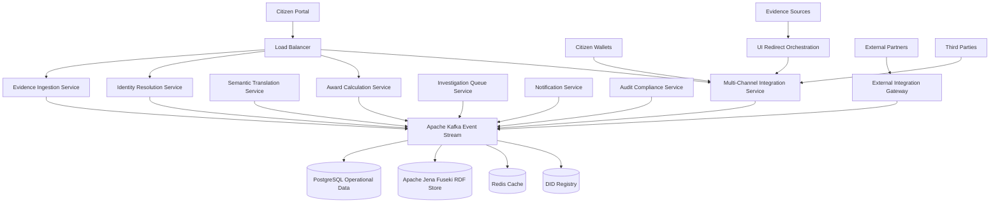

# Appendix A: Technical Specifications

This appendix provides comprehensive technical specifications for implementing evidence-based identity platforms, including detailed API schemas, data models, security frameworks, deployment configurations, multi-channel evidence integration, and semantic translation patterns. These specifications enable technical teams to build production-ready systems that serve citizens through multiple pathways while maintaining democratic accountability and citizen rights protection.

## Architecture Overview

The evidence-based identity platform operates through eight core microservices that handle evidence ingestion, identity resolution, semantic translation, decision calculation, fraud investigation, citizen notification, audit compliance, and external integration. The architecture supports multiple citizen interaction methods including digital identity wallets for advanced users, UI redirect orchestration for guided evidence gathering, API integration for seamless evidence collection, and traditional document processing, all maintaining cryptographic verifiability and semantic integrity.



The architecture emphasizes horizontal scalability, fault tolerance, and democratic accountability through comprehensive audit trails, citizen control mechanisms, and explainable decision-making processes. The Multi-Channel Integration Service enables citizens to interact through their preferred method: wallet-mediated evidence sharing for those comfortable with digital credentials, guided evidence gathering through familiar authentication for those preferring assisted approaches, or traditional document submission, all while maintaining semantic translation capabilities that handle ontological differences between organizations.

## Evidence Data Model Specification

The evidence data model provides structured representation of all information about citizen circumstances while maintaining provenance, confidence assessment, and privacy protection. The model supports complex reasoning while preserving citizen rights and democratic accountability, with extensions for multi-channel evidence collection including wallet-mediated sharing, API integration, and guided evidence gathering.

### Core Evidence Structure

```json
{
  "evidenceId": "evt_2025_09_27_hmrc_001247",
  "version": "1.0",
  "created": "2025-09-27T14:23:17.123Z",
  "source": {
    "organizationId": "hmrc.gov.uk",
    "organizationType": "TAX_AUTHORITY",
    "systemId": "real-time-information",
    "verificationCapabilities": [
      "EMPLOYER_REPORTING",
      "PAYROLL_VERIFICATION", 
      "TAX_CALCULATION"
    ],
    "reliabilityScore": 0.94,
    "legalAuthority": "Income Tax (Pay As You Earn) Regulations 2003",
    "contactInformation": {
      "technicalContact": "rti-support@hmrc.gov.uk",
      "legalContact": "data-protection@hmrc.gov.uk"
    },
    "walletCompatibility": {
      "supportsVerifiableCredentials": true,
      "didMethods": ["did:web", "did:key"],
      "credentialFormats": ["JSON-LD", "JWT"],
      "zkProofSupport": ["age-verification", "income-thresholds"]
    }
  },
  "subject": {
    "identityClusterId": "citizen_cluster_AB123456C",
    "identityConfidence": 0.947,
    "didIdentifiers": [
      {
        "did": "did:web:gov.uk:citizen:AB123456C",
        "confidence": 0.99,
        "method": "government-issued"
      },
      {
        "did": "did:key:z6MkhaXgBZDvotDkL5257faiztiGiC2QtKLGpbnnEGta2doK",
        "confidence": 0.95,
        "method": "citizen-controlled"
      }
    ],
    "alternativeIds": [
      {
        "type": "NATIONAL_INSURANCE_NUMBER",
        "value": "AB123456C",
        "confidence": 0.99
      },
      {
        "type": "TAX_REFERENCE", 
        "value": "1234567890",
        "confidence": 0.95
      }
    ],
    "demographicHints": {
      "approximateAge": "25-34",
      "regionCode": "E12000007", // London
      "confidenceLevel": 0.85
    }
  },
  "assertion": {
    "predicate": "http://gov.uk/ontology/employment#earnedIncome",
    "object": {
      "value": "34164.00",
      "dataType": "decimal",
      "currency": "GBP",
      "period": {
        "start": "2024-04-06",
        "end": "2025-04-05",
        "type": "TAX_YEAR"
      }
    },
    "semanticContext": "http://gov.uk/ontology/employment#v2.1",
    "conditionalLogic": {
      "conditions": [
        "subject.employmentStatus == 'EMPLOYED'",
        "subject.ukResident == true",
        "income.source == 'EMPLOYMENT'"
      ],
      "certainty": 0.96
    },
    "walletPresentationCapability": {
      "selectiveDisclosure": true,
      "zkProofs": ["income-above-threshold", "employment-verified"],
      "expirationHandling": "confidence-decay",
      "revocationMethod": "status-list-2021"
    }
  },
  "verification": {
    "method": "EMPLOYER_RTI_SUBMISSION",
    "timestamp": "2025-09-27T10:23:17Z",
    "verifierIdentity": "hmrc-automated-system-v4.2",
    "cryptographicProof": {
      "signatureMethod": "Ed25519",
      "signature": "3045022100a1b2c3d4e5f6789...",
      "publicKey": "did:web:hmrc.gov.uk#verification-key-1",
      "proofPurpose": "assertionMethod"
    },
    "verificationSteps": [
      {
        "step": "EMPLOYER_SUBMISSION_RECEIVED",
        "timestamp": "2025-09-27T10:20:15Z",
        "result": "PASS"
      },
      {
        "step": "PAYROLL_CONSISTENCY_CHECK",
        "timestamp": "2025-09-27T10:21:33Z", 
        "result": "PASS"
      },
      {
        "step": "HISTORICAL_PATTERN_ANALYSIS",
        "timestamp": "2025-09-27T10:22:41Z",
        "result": "CONSISTENT"
      }
    ],
    "evidenceDocuments": [
      {
        "type": "P60_TAX_CERTIFICATE",
        "hash": "sha256:a1b2c3d4e5f6...",
        "encrypted": true,
        "accessRequiresConsent": true
      }
    ],
    "biometricHashes": [],
    "crossVerificationSources": [
      "pension-contributions-verification",
      "student-loan-deductions-verification"
    ]
  },
  "confidence": {
    "overallScore": 0.96,
    "dimensions": {
      "sourceReliability": 0.94,
      "verificationRigor": 0.98,
      "temporalFreshness": 0.95,
      "corroborationLevel": 0.97,
      "consistency": 0.96,
      "cryptographicIntegrity": 0.99
    },
    "uncertaintyFactors": [
      {
        "factor": "EMPLOYER_REPORTING_LAG",
        "impact": -0.02,
        "description": "Minor delay in employer reporting"
      }
    ],
    "calculationMethod": "WEIGHTED_HARMONIC_MEAN",
    "lastCalculated": "2025-09-27T14:23:17Z",
    "walletTransferConfidence": {
      "degradationRate": 0.05,
      "transferPreservation": 0.98,
      "semanticTranslationImpact": -0.03
    }
  },
  "provenance": {
    "originalSource": "employer-payroll-system",
    "intermediateProcessing": [
      {
        "system": "hmrc-rti-gateway",
        "timestamp": "2025-09-27T10:20:45Z",
        "operation": "DATA_VALIDATION"
      },
      {
        "system": "hmrc-fraud-detection",
        "timestamp": "2025-09-27T10:22:15Z", 
        "operation": "ANOMALY_SCREENING"
      }
    ],
    "transformationChain": [
      {
        "input": "EMPLOYER_P45_SUBMISSION",
        "transformation": "TAX_YEAR_AGGREGATION",
        "output": "ANNUAL_INCOME_EVIDENCE",
        "confidence": 0.98
      }
    ],
    "cryptographicSignatures": [
      {
        "signer": "hmrc-evidence-service",
        "algorithm": "Ed25519",
        "signature": "3045022100...",
        "timestamp": "2025-09-27T14:23:17Z"
      }
    ],
    "walletProvenance": {
      "credentialIssuer": "did:web:hmrc.gov.uk",
      "issuanceDate": "2025-09-27T14:23:17Z",
      "proofChain": ["hmrc-ca-cert", "gov-root-cert"],
      "revocationRegistry": "https://hmrc.gov.uk/credentials/status"
    },
    "auditTrail": [
      {
        "event": "EVIDENCE_CREATED",
        "timestamp": "2025-09-27T14:23:17Z",
        "actor": "hmrc-automated-system",
        "reason": "ANNUAL_TAX_YEAR_COMPLETION"
      }
    ]
  },
  "temporalValidity": {
    "validFrom": "2024-04-06T00:00:00Z",
    "validUntil": "2025-04-05T23:59:59Z",
    "lastVerified": "2025-09-27T14:23:17Z",
    "nextVerificationDue": "2026-04-06T00:00:00Z",
    "verificationFrequency": "ANNUAL",
    "stabilityIndicators": {
      "employmentContinuity": 0.94,
      "incomeConsistency": 0.89,
      "addressStability": 0.92
    },
    "credentialExpiration": {
      "expiresAt": "2026-04-06T00:00:00Z",
      "renewalWindow": "P30D",
      "autoRenewalSupported": true
    }
  },
  "privacyMetadata": {
    "sensitivityLevel": "FINANCIAL_PERSONAL",
    "dataClassification": "RESTRICTED",
    "shareabilityConstraints": [
      {
        "constraint": "CITIZEN_CONSENT_REQUIRED",
        "exceptions": ["FRAUD_INVESTIGATION", "COURT_ORDER"]
      },
      {
        "constraint": "PURPOSE_LIMITATION", 
        "allowedPurposes": ["BENEFIT_ASSESSMENT", "TAX_CALCULATION"]
      }
    ],
    "retentionPeriod": "P7Y", // ISO 8601 duration: 7 years
    "anonymizationRequired": true,
    "anonymizationDate": "2032-09-27T14:23:17Z",
    "crossBorderTransferAllowed": false,
    "citizenAccessRights": {
      "viewable": true,
      "downloadable": true,
      "correctable": true,
      "deletable": false, // Required for legal compliance
      "walletExportable": true,
      "selectiveDisclosureEnabled": true
    },
    "walletPrivacyFeatures": {
      "zkProofSupported": true,
      "selectiveDisclosure": true,
      "unlinkablePresentations": true,
      "predicateProofs": ["age>18", "income>threshold"]
    }
  },
  "qualityMetrics": {
    "completeness": 0.98,
    "accuracy": 0.96,
    "consistency": 0.94,
    "timeliness": 0.95,
    "validity": 0.97,
    "interoperability": 0.93
  },
  "democraticAccountability": {
    "citizenExplanation": {
      "available": true,
      "language": "en-GB",
      "readingLevel": "PLAIN_ENGLISH",
      "accessMethod": "CITIZEN_PORTAL"
    },
    "appealRights": {
      "appealable": true,
      "appealPeriod": "P28D", // 28 days
      "appealProcess": "UNIFIED_GOVERNMENT_APPEALS"
    },
    "parliamentaryAccountability": {
      "includedInStatistics": true,
      "redactedForPrivacy": true,
      "reportingFrequency": "QUARTERLY"
    }
  }
}
```

### Verifiable Credential Data Model

```json
{
  "@context": [
    "https://www.w3.org/2018/credentials/v1",
    "https://www.w3.org/2018/credentials/examples/v1",
    "https://gov.uk/credentials/v1"
  ],
  "type": ["VerifiableCredential", "GovernmentBenefitCredential"],
  "id": "https://gov.uk/credentials/housing-support/12345",
  "issuer": {
    "id": "did:web:dcs.gov.uk",
    "name": "Department of Citizen Services"
  },
  "issuanceDate": "2025-09-27T14:23:17Z",
  "expirationDate": "2026-09-27T14:23:17Z",
  "credentialSubject": {
    "id": "did:key:z6MkhaXgBZDvotDkL5257faiztiGiC2QtKLGpbnnEGta2doK",
    "benefitEntitlement": {
      "type": "HousingSupport",
      "monthlyAmount": {
        "value": 847,
        "currency": "GBP"
      },
      "validFrom": "2025-09-27",
      "validUntil": "2026-09-27",
      "eligibilityBasis": {
        "employment": "verified-terminated",
        "housingCosts": "verified-affordable-housing",
        "residency": "verified-uk-resident"
      },
      "confidenceScore": 0.94
    },
    "selectiveDisclosureMap": {
      "benefitEntitlement": {
        "type": "always-disclosed",
        "monthlyAmount": "citizen-controlled",
        "eligibilityBasis": "granular-control"
      }
    }
  },
  "credentialStatus": {
    "id": "https://gov.uk/credentials/status/12345",
    "type": "StatusList2021Entry",
    "statusListIndex": "94567",
    "statusListCredential": "https://gov.uk/credentials/status-list/1"
  },
  "proof": {
    "type": "Ed25519Signature2020",
    "created": "2025-09-27T14:23:17Z",
    "verificationMethod": "did:web:dcs.gov.uk#key-1",
    "proofPurpose": "assertionMethod",
    "proofValue": "eyJhbGciOiJFZERTQSIsImI2NCI6ZmFsc2UsImNyaXQiOlsiYjY0Il19..."
  },
  "evidenceProvenance": {
    "sourceEvidence": ["evt_2025_09_27_hmrc_001247", "evt_2025_09_27_council_housing_789"],
    "decisionTimestamp": "2025-09-27T14:23:17Z",
    "confidenceCalculation": "WEIGHTED_HARMONIC_MEAN",
    "auditTrail": "https://gov.uk/audit/housing-support/12345"
  },
  "semanticMapping": {
    "sourceOntology": "http://gov.uk/ontology/housing-support#v2.1",
    "compatibleOntologies": [
      "http://utilities.org/ontology/low-income-tariff#v1.0",
      "http://local-authorities.gov.uk/ontology/social-housing#v3.2"
    ],
    "translationConfidence": 0.92
  }
}
```

### Digital Identity Wallet Communication Protocol

```json
{
  "protocolVersion": "DIDComm-v2.0",
  "messageType": "credential-offer",
  "id": "uuid-credential-offer-001",
  "from": "did:web:dcs.gov.uk",
  "to": "did:key:z6MkhaXgBZDvotDkL5257faiztiGiC2QtKLGpbnnEGta2doK",
  "created_time": "2025-09-27T14:23:17Z",
  "body": {
    "credential_preview": {
      "@type": "https://gov.uk/protocols/credential-preview",
      "attributes": [
        {
          "name": "benefit_type",
          "value": "housing_support"
        },
        {
          "name": "monthly_amount",
          "value": "847",
          "currency": "GBP"
        },
        {
          "name": "valid_from",
          "value": "2025-09-27"
        }
      ]
    },
    "offers": [
      {
        "attachment_id": "housing-support-credential",
        "format": "vc+json-ld"
      }
    ],
    "citizen_control": {
      "selective_disclosure_supported": true,
      "zero_knowledge_proofs": ["amount-above-threshold", "valid-entitlement"],
      "expiration_notification": "30-days-before",
      "auto_renewal_option": true
    }
  },
  "attachments": [
    {
      "id": "housing-support-credential",
      "mime-type": "application/json",
      "data": {
        "base64": "eyJAY29udGV4dCI6WyJodHRwczovL3d3dy53My5vcmcvMjAxOC9jcmVkZW50aWFscy92MSJd..."
      }
    }
  ]
}
```

## API Specifications

### Multi-Channel Evidence Ingestion API

```yaml
openapi: 3.0.0
info:
  title: Multi-Channel Evidence Ingestion API
  version: 3.0.0
  description: Evidence ingestion supporting multiple pathways including wallet integration, UI redirect orchestration, API integration, and traditional submission

paths:
  /evidence:
    post:
      summary: Submit new evidence through multiple channels
      requestBody:
        required: true
        content:
          application/json:
            schema:
              oneOf:
                - $ref: '#/components/schemas/DirectEvidenceSubmission'
                - $ref: '#/components/schemas/WalletMediatedSubmission'
                - $ref: '#/components/schemas/APIIntegratedSubmission'
                - $ref: '#/components/schemas/RedirectOrchestrationSubmission'
      responses:
        '201':
          description: Evidence accepted
          content:
            application/json:
              schema:
                $ref: '#/components/schemas/EvidenceReceipt'
        '400':
          description: Invalid evidence format
        '401':
          description: Unauthorized source
        '422':
          description: Evidence validation failed

  /evidence/wallet-presentation:
    post:
      summary: Accept wallet-mediated evidence presentation
      requestBody:
        required: true
        content:
          application/json:
            schema:
              $ref: '#/components/schemas/VerifiablePresentationSubmission'
      responses:
        '201':
          description: Presentation verified and evidence extracted
        '400':
          description: Invalid presentation format
        '403':
          description: Presentation verification failed

  /credentials/issue:
    post:
      summary: Issue verifiable credential to citizen wallet
      requestBody:
        required: true
        content:
          application/json:
            schema:
              $ref: '#/components/schemas/CredentialIssuanceRequest'
      responses:
        '201':
          description: Credential issued successfully
        '400':
          description: Invalid issuance request

components:
  schemas:
    WalletMediatedSubmission:
      type: object
      properties:
        presentationType: 
          type: string
          enum: [verifiable-presentation, zero-knowledge-proof]
        presentation:
          $ref: '#/components/schemas/VerifiablePresentation'
        citizenConsent:
          $ref: '#/components/schemas/ConsentRecord'
        purpose:
          type: string
          description: Purpose for which evidence is being shared
        
    VerifiablePresentationSubmission:
      type: object
      properties:
        presentation:
          $ref: '#/components/schemas/VerifiablePresentation'
        challenge:
          type: string
          description: Challenge provided by verifier to prevent replay attacks
        domain:
          type: string
          description: Domain where presentation is being submitted
          
    CredentialIssuanceRequest:
      type: object
      properties:
        citizenDID:
          type: string
          pattern: '^did:'
        evidenceReferences:
          type: array
          items:
            type: string
        credentialType:
          type: string
          enum: [benefit-entitlement, employment-verification, housing-support]
        deliveryMethod:
          type: string
          enum: [wallet-direct, portal-download, both]
```

### Multi-Channel Integration Service API

```yaml
paths:
  /channels/wallet/connect:
    post:
      summary: Establish connection with citizen wallet
      requestBody:
        required: true
        content:
          application/json:
            schema:
              type: object
              properties:
                invitationCode:
                  type: string
                citizenDID:
                  type: string
                walletEndpoint:
                  type: string
      responses:
        '200':
          description: Connection established
          
  /channels/redirect/initiate:
    post:
      summary: Initiate UI redirect orchestration for guided evidence gathering
      requestBody:
        required: true
        content:
          application/json:
            schema:
              type: object
              properties:
                citizenId:
                  type: string
                evidenceSourceId:
                  type: string
                requiredEvidenceTypes:
                  type: array
                  items:
                    type: string
                returnUrl:
                  type: string
                sessionToken:
                  type: string
      responses:
        '200':
          description: Redirect URL generated
          content:
            application/json:
              schema:
                type: object
                properties:
                  redirectUrl:
                    type: string
                  sessionId:
                    type: string
                  expiresAt:
                    type: string
                    format: date-time
          
  /channels/api/integrate:
    post:
      summary: Direct API integration with evidence sources
      requestBody:
        required: true
        content:
          application/json:
            schema:
              type: object
              properties:
                citizenId:
                  type: string
                evidenceSourceId:
                  type: string
                authorizationToken:
                  type: string
                evidenceQuery:
                  type: object
      responses:
        '200':
          description: Evidence retrieved via API
          
  /channels/wallet/credential-offer:
    post:
      summary: Offer credential to citizen wallet
      requestBody:
        required: true
        content:
          application/json:
            schema:
              type: object
              properties:
                connectionId:
                  type: string
                credentialDefinition:
                  $ref: '#/components/schemas/CredentialDefinition'
                evidenceBasis:
                  type: array
                  items:
                    type: string
                    
  /wallet/proof-request:
    post:
      summary: Request proof from citizen wallet
      requestBody:
        required: true
        content:
          application/json:
            schema:
              type: object
              properties:
                connectionId:
                  type: string
                proofRequest:
                  $ref: '#/components/schemas/ProofRequest'
                purpose:
                  type: string
```

### Identity Resolution API with DID Support

```yaml
paths:
  /identity/resolve:
    post:
      summary: Resolve identity cluster with DID correlation
      requestBody:
        required: true
        content:
          application/json:
            schema:
              type: object
              properties:
                identityHints:
                  type: array
                  items:
                    type: object
                    properties:
                      type: 
                        type: string
                        enum: [nationalId, biometric, attribute, did, walletPresentation]
                      value:
                        type: string
                      confidence:
                        type: number
                        minimum: 0
                        maximum: 1
                didReferences:
                  type: array
                  items:
                    type: string
                    pattern: '^did:'
      responses:
        '200':
          description: Identity resolution results with DID correlation
          content:
            application/json:
              schema:
                type: object
                properties:
                  clusters:
                    type: array
                    items:
                      $ref: '#/components/schemas/IdentityClusterWithDID'
                  confidence:
                    type: number
                  didCorrelation:
                    type: object
                    properties:
                      correlatedDIDs:
                        type: array
                      correlationConfidence:
                        type: number
                      ambiguityFlags:
                        type: array
```

## Security Framework Specifications

### Digital Identity Wallet Security

```yaml
WalletSecurityFramework:
  CredentialIntegrity:
    signingAlgorithms:
      - Ed25519
      - ECDSA-secp256k1
      - BLS12-381
    hashFunctions:
      - SHA-3-256
      - BLAKE2b
    proofFormats:
      - JSON-LD-Proofs
      - JWT-VCs
      - CBOR-Web-Tokens
      
  PrivacyPreservation:
    zeroKnowledgeProofs:
      framework: arkworks-rs
      circuits:
        - age-verification
        - income-threshold-proofs
        - benefit-eligibility
      proofSystems:
        - Groth16
        - PLONK
        - Bulletproofs
        
    selectiveDisclosure:
      methodology: BBS+-Signatures
      implementation: bbs-signatures-rs
      granularity: attribute-level
      
    unlinkability:
      presentationTokens: random-per-presentation
      didRotation: citizen-controlled
      correlationResistance: cryptographic-separation
      
  CommunicationSecurity:
    didComm:
      version: DIDComm-v2
      encryption: ChaCha20Poly1305
      signing: Ed25519
      keyAgreement: X25519
      
    transportSecurity:
      protocol: TLS-1.3
      certificatePinning: enabled
      perfectForwardSecrecy: required
      
  KeyManagement:
    didKeys:
      generation: secure-hardware-when-available
      storage: encrypted-local-storage
      backup: citizen-controlled-recovery
      rotation: automatic-with-notification
      
    credentialKeys:
      derivation: HKDF-SHA256
      storage: secure-enclave-preferred
      usage: single-purpose-keys
      revocation: status-list-2021
```

### Cryptographic Standards and Implementation

```yaml
EncryptionStandards:
  DataAtRest:
    algorithm: AES-256-GCM
    keyManagement: HSM-based-with-wallet-integration
    keyRotation: 90-day-automatic
    walletData: citizen-controlled-encryption
    
  DataInTransit:
    protocol: TLS-1.3
    certificateValidation: mutual-TLS
    walletCommunication: DIDComm-v2-encryption
    cipherSuites: 
      - TLS_AES_256_GCM_SHA384
      - TLS_CHACHA20_POLY1305_SHA256
      
  DigitalSignatures:
    algorithm: Ed25519
    fallback: ECDSA-P256
    hashFunction: SHA-3-256
    timestamping: RFC3161-compliant
    walletSignatures: BBS+-for-selective-disclosure
    
  ZeroKnowledgeProofs:
    framework: arkworks-rs
    curves: BLS12-381-BN254
    proofSystems:
      - Groth16-for-efficiency
      - PLONK-for-flexibility
      - Bulletproofs-for-range-proofs
    applications:
      - age-verification-without-revealing-birthdate
      - income-threshold-without-revealing-amount
      - benefit-eligibility-without-revealing-circumstances
```

### Authentication and Authorization with DID Integration

```yaml
AuthenticationFramework:
  CitizenAuthentication:
    primary: DID-based-authentication
    methods:
      - wallet-presentation-proof
      - biometric-with-DID
      - multifactor-mobile-app
    fallback: SMS-OTP-with-identity-recovery
    sessionManagement: DID-bound-JWT-tokens
    
  WalletAuthentication:
    didProofOfControl: signature-challenge-response
    walletBinding: cryptographic-key-attestation
    connectionEstablishment: DIDComm-invitation-flow
    consentManagement: granular-purpose-specific
    
  OrganizationAuthentication:
    method: mutual-TLS-certificates-plus-DID
    identityProvider: Government-PKI-with-DID-registry
    authorization: RBAC-with-ABAC-and-wallet-permissions
    auditLogging: comprehensive-with-DID-correlation
    
  ThirdPartyAuthentication:
    walletPresentations: verifiable-credential-proofs
    purposeBinding: cryptographic-consent-tokens
    timeboxed: presentation-specific-challenges
    auditTrail: immutable-interaction-logs
```

## Semantic Translation Framework

### Ontology Management with Wallet Integration

```yaml
SemanticTranslationFramework:
  CoreOntologies:
    governmentServices: "http://gov.uk/ontology/services/v2.1"
    evidenceTypes: "http://gov.uk/ontology/evidence/v2.1" 
    citizenIdentity: "http://gov.uk/ontology/identity/v2.1"
    benefitEntitlements: "http://gov.uk/ontology/benefits/v2.1"
    walletCredentials: "http://gov.uk/ontology/credentials/v2.1"
    
  ExternalOntologies:
    utilities: "http://utilities.org/ontology/customer-verification/v1.0"
    financialServices: "http://financial.org/ontology/kyc/v3.0"
    healthcare: "http://nhs.uk/ontology/patient-verification/v1.2"
    employment: "http://employers.org/ontology/workforce/v2.0"
    
  MappingDefinitions:
    language: R2RML-RDB-to-RDF-with-wallet-extensions
    execution: Apache-Jena-ARQ-with-credential-reasoning
    confidence: mapping-specific-scoring-with-wallet-degradation
    validation: SHACL-constraint-validation-plus-credential-schemas
    walletTranslation: automatic-semantic-bridging-for-presentations
    
  TranslationEngine:
    implementation: Apache-Jena-Fuseki-with-wallet-integration
    inference: RDFS-plus-custom-rules-plus-credential-reasoning
    query: SPARQL-1.1-federation-with-wallet-proof-verification
    performance: query-optimization-with-credential-caching
    walletSupport: real-time-semantic-translation-for-presentations
```

### Cross-Organization Semantic Coordination

```yaml
CrossOrganizationSemantics:
  GovernmentToThirdParty:
    benefitEntitlement:
      dwpMapping: "monthly_housing_support"
      utilityMapping: "low_income_tariff_eligibility"
      confidencePreservation: 0.95
      semanticBridge: "entitlement-based-discount"
      
    employmentVerification:
      hmrcMapping: "employment_verified_active"
      bankMapping: "employment_income_verification"
      confidencePreservation: 0.92
      semanticBridge: "income-source-verification"
      
    ageVerification:
      hmpoMapping: "citizen_age_verified"
      vendorMapping: "age_above_threshold"
      confidencePreservation: 0.98
      semanticBridge: "zero-knowledge-age-proof"
      
  ConfidenceTranslation:
    crossOrganizationalDegradation: 0.03-0.05
    semanticTranslationImpact: 0.02-0.04
    walletMediatedPreservation: 0.98
    zeroKnowledgeProofConfidence: 0.95
    temporalDecayModeling: exponential-with-evidence-type-factors
    
  WalletMediatedTranslation:
    realTimeTranslation: semantic-bridging-at-presentation
    contextPreservation: confidence-and-provenance-maintained
    purposeSpecificMapping: different-translations-for-different-uses
    citizenVisibility: translation-explanations-in-wallet-interface
```

## Integration Patterns

### Multi-Channel Integration Patterns

```yaml
IntegrationPatterns:
  WalletBasedIntegration:
    standardCredentials: W3C-Verifiable-Credentials
    presentationProtocol: DIDComm-v2
    verificationMethods: cryptographic-proof-verification
    citizenControl: full-credential-management
    
  UIRedirectOrchestration:
    initiationFlow: secure-redirect-URL-generation
    authenticationMethod: evidence-source-native-authentication
    evidenceBinding: DID-based-verification-without-citizen-wallet
    returnFlow: callback-with-cryptographically-bound-evidence
    securityModel: OAuth2-with-DID-binding-plus-session-management
    
  DirectAPIIntegration:
    authentication: OAuth2-client-credentials-with-citizen-authorization
    evidenceRetrieval: real-time-API-calls-to-evidence-sources
    confidencePreservation: source-specific-confidence-scoring
    citizenConsent: granular-evidence-sharing-permissions
    
  TraditionalSubmission:
    documentProcessing: automated-OCR-with-manual-verification
    confidenceScoring: document-verification-algorithms
    auditTrail: complete-processing-history-with-human-oversight
    citizenSupport: assistance-with-document-preparation
    
  HybridIntegration:
    citizenChoice: multiple-pathway-selection-based-on-capability
    seamlessTransition: consistent-evidence-binding-across-methods
    confidenceAlignment: unified-scoring-regardless-of-collection-method
    auditConsistency: comprehensive-logging-across-all-pathways
    
  MessageQueue:
    protocol: AMQP-1.0-with-DIDComm-bridging
    implementation: Apache-Kafka-with-wallet-event-streams
    durability: persistent-messages-with-credential-correlation
    ordering: partition-based-with-DID-routing
    
  EventSourcing:
    eventStore: EventStore-DB-with-wallet-event-correlation
    projections: real-time-updates-with-credential-state-sync
    snapshots: configurable-intervals-with-wallet-state-backup
    replay: full-system-rebuild-with-wallet-consistency
```

### Semantic Translation with Wallet Presentations

```yaml
WalletSemanticTranslation:
  PresentationProcessing:
    credentialValidation: cryptographic-verification-first
    semanticExtraction: ontology-based-claim-interpretation
    confidenceMapping: credential-confidence-to-system-confidence
    contextPreservation: presentation-purpose-semantic-context
    
  CrossOntologyMapping:
    automatedTranslation: real-time-semantic-bridging
    humanValidation: complex-case-escalation
    confidenceCalculation: translation-uncertainty-quantification
    auditTrail: complete-translation-decision-provenance
    
  ZeroKnowledgeProofHandling:
    proofVerification: cryptographic-proof-validation
    semanticInterpretation: threshold-based-claim-extraction
    confidenceAssessment: proof-specific-confidence-calculation
    privacyPreservation: no-underlying-data-exposure
    
  SelectiveDisclosureProcessing:
    attributeFiltering: citizen-controlled-information-sharing
    semanticCompletion: inference-based-missing-attribute-handling
    confidenceAdjustment: partial-information-confidence-reduction
    purposeValidation: shared-attributes-purpose-appropriateness-check
```

## Deployment Specifications

### Kubernetes Configuration with Wallet Integration

```yaml
apiVersion: apps/v1
kind: Deployment
metadata:
  name: wallet-integration-service
  labels:
    app: wallet-integration
    component: citizen-services
spec:
  replicas: 3
  selector:
    matchLabels:
      app: wallet-integration
  template:
    metadata:
      labels:
        app: wallet-integration
    spec:
      containers:
      - name: wallet-integration
        image: gov.uk/evidence-platform/wallet-integration:v2.0.0
        ports:
        - containerPort: 8080
          name: http
        - containerPort: 8443
          name: didcomm
        env:
        - name: DID_REGISTRY_URL
          valueFrom:
            configMapKeyRef:
              name: did-config
              key: registry-url
        - name: WALLET_ENCRYPTION_KEY
          valueFrom:
            secretKeyRef:
              name: wallet-secrets
              key: encryption-key
        - name: CREDENTIAL_SIGNING_KEY
          valueFrom:
            secretKeyRef:
              name: credential-secrets
              key: signing-key
        resources:
          requests:
            memory: "1Gi"
            cpu: "500m"
          limits:
            memory: "2Gi"
            cpu: "1000m"
        livenessProbe:
          httpGet:
            path: /health
            port: 8080
          initialDelaySeconds: 30
          periodSeconds: 10
        readinessProbe:
          httpGet:
            path: /ready
            port: 8080
          initialDelaySeconds: 10
          periodSeconds: 5
        volumeMounts:
        - name: did-keys
          mountPath: /keys/did
          readOnly: true
        - name: credential-schemas
          mountPath: /schemas
          readOnly: true
      volumes:
      - name: did-keys
        secret:
          secretName: did-key-store
      - name: credential-schemas
        configMap:
          name: credential-schemas
---
apiVersion: v1
kind: Service
metadata:
  name: wallet-integration-service
spec:
  selector:
    app: wallet-integration
  ports:
  - name: http
    port: 80
    targetPort: 8080
  - name: didcomm
    port: 443
    targetPort: 8443
  type: ClusterIP
```

### DID Registry Configuration

```yaml
apiVersion: apps/v1
kind: Deployment
metadata:
  name: did-registry
spec:
  replicas: 2
  selector:
    matchLabels:
      app: did-registry
  template:
    metadata:
      labels:
        app: did-registry
    spec:
      containers:
      - name: did-registry
        image: gov.uk/evidence-platform/did-registry:v1.0.0
        env:
        - name: BLOCKCHAIN_ENDPOINT
          value: "https://ethereum-node.gov.uk"
        - name: IPFS_GATEWAY
          value: "https://ipfs.gov.uk"
        - name: REGISTRY_CONTRACT
          value: "0x742d35cc769c8b500..." 
        resources:
          requests:
            memory: "512Mi"
            cpu: "250m"
          limits:
            memory: "1Gi"
            cpu: "500m"
```

### Monitoring and Observability with Wallet Metrics

```yaml
MonitoringStack:
  Metrics:
    collector: Prometheus-with-wallet-integration-metrics
    retention: 30-days
    alerting: AlertManager-with-credential-issuance-alerts
    dashboards: Grafana-with-wallet-usage-analytics
    walletMetrics:
      - credential-issuance-rate
      - presentation-verification-time
      - did-resolution-latency
      - zero-knowledge-proof-generation-time
      
  Logging:
    collector: Fluent-Bit-with-DIDComm-message-parsing
    storage: Elasticsearch-with-credential-event-indexing
    analysis: Kibana-with-wallet-interaction-dashboards
    retention: 7-years-compliance
    walletLogs:
      - credential-lifecycle-events
      - presentation-protocol-messages
      - consent-management-actions
      - semantic-translation-operations
      
  Tracing:
    implementation: Jaeger-with-DID-correlation
    sampling: adaptive-sampling-with-wallet-operations
    retention: 7-days
    correlation: trace-id-propagation-across-wallet-boundaries
    walletTracing:
      - end-to-end-credential-issuance
      - presentation-verification-flows
      - semantic-translation-pipelines
      - citizen-consent-workflows
      
  SLI/SLO:
    availability: 99.9%-uptime-including-wallet-services
    latency: 
      - credential-issuance-under-2-seconds
      - presentation-verification-under-500ms
      - did-resolution-under-200ms
    errorRate: less-than-0.1%-for-all-wallet-operations
    throughput: 
      - 1000-credential-issuances-per-second
      - 10000-presentation-verifications-per-second
```

## Compliance and Audit Framework

### GDPR Compliance with Wallet Privacy

```yaml
GDPRComplianceWithWallets:
  LegalBasis:
    processing: public-task-Article-6-1-e
    specialCategories: substantial-public-interest-Article-9-2-g
    walletProcessing: citizen-consent-Article-6-1-a
    documentation: comprehensive-ROPA-including-wallet-processing
    
  DataSubjectRights:
    access: automated-export-within-30-days-including-wallet-data
    rectification: real-time-correction-with-credential-reissuance
    erasure: automated-anonymization-with-credential-revocation
    portability: wallet-export-with-verifiable-credentials
    objection: opt-out-with-wallet-credential-management
    dataPortability: full-wallet-export-in-standard-formats
    
  WalletSpecificRights:
    credentialControl: citizen-managed-credential-lifecycle
    selectiveDisclosure: granular-attribute-sharing-control
    presentationAudit: complete-presentation-history-access
    consentManagement: real-time-consent-modification
    
  PrivacyByDesign:
    dataMinimization: purpose-specific-collection-with-zk-proofs
    storageLimit: automated-retention-with-credential-expiration
    accuracy: continuous-data-quality-with-source-verification
    security: encryption-and-access-controls-plus-wallet-security
    walletPrivacy: citizen-controlled-privacy-preferences
```

### Audit Trail Specifications with Wallet Integration

```yaml
AuditFramework:
  EventLogging:
    format: CloudEvents-v1.0-with-wallet-extensions
    storage: immutable-append-only-log-with-DID-correlation
    integrity: cryptographic-signatures-with-wallet-provenance
    retention: 7-years-minimum
    walletEvents:
      - credential-issuance-and-acceptance
      - presentation-creation-and-verification
      - consent-grants-and-modifications
      - semantic-translation-operations
      
  AuditableEvents:
    traditional:
      - evidence-submission
      - identity-resolution
      - decision-calculation
      - data-access-by-officials
      - system-configuration-updates
    walletSpecific:
      - credential-offers-and-acceptances
      - presentation-requests-and-responses
      - did-key-rotations
      - wallet-connection-establishments
      - zero-knowledge-proof-generations
      - selective-disclosure-presentations
      
  ComplianceReporting:
    frequency: monthly-automated-reports-including-wallet-usage
    scope: comprehensive-system-usage-plus-wallet-interactions
    recipients: democratic-oversight-bodies
    format: machine-readable-JSON-with-wallet-analytics
    walletAnalytics:
      - credential-adoption-rates
      - presentation-frequency-analysis
      - citizen-privacy-preference-trends
      - semantic-translation-effectiveness
```

## Performance and Scalability Specifications

### Load Testing Requirements with Wallet Operations

```yaml
PerformanceRequirements:
  LoadTesting:
    normalLoad: 
      - 1000-concurrent-users
      - 500-concurrent-wallet-operations
    peakLoad: 
      - 10000-concurrent-users
      - 5000-concurrent-wallet-operations
    sustainedLoad: 24-hour-endurance-with-wallet-operations
    spikeTesting: 50x-normal-load-including-credential-issuance
    
  ResponseTimes:
    evidenceSubmission: under-2-seconds
    identityResolution: under-1-second
    decisionCalculation: under-5-seconds
    citizenPortalAccess: under-500ms
    walletOperations:
      - credential-issuance: under-3-seconds
      - presentation-verification: under-500ms
      - did-resolution: under-200ms
      - zero-knowledge-proof-generation: under-10-seconds
      
  Throughput:
    evidenceProcessing: 10000-events-per-second
    identityQueries: 50000-requests-per-second
    decisionCalculations: 1000-complex-cases-per-second
    walletOperations:
      - credential-issuances: 1000-per-second
      - presentation-verifications: 10000-per-second
      - semantic-translations: 5000-per-second
      
  Availability:
    uptime: 99.9%-excluding-planned-maintenance
    maintenanceWindows: maximum-4-hours-monthly
    disasterRecovery: 4-hour-RTO-1-hour-RPO
    walletAvailability: 99.95%-for-citizen-controlled-operations
```

### Scalability Architecture with Wallet Distribution

```yaml
ScalabilityArchitecture:
  HorizontalScaling:
    microservices: independent-scaling-per-service
    walletIntegration: distributed-wallet-service-mesh
    loadBalancing: did-aware-request-routing
    caching: wallet-state-caching-with-consistency
    
  DatabaseScaling:
    tripleStore: federated-jena-clusters
    operationalDB: postgres-read-replicas
    didRegistry: blockchain-backed-with-ipfs-content
    walletState: encrypted-distributed-storage
    
  CachingStrategy:
    identityClusters: redis-clustering-with-did-keys
    semanticMappings: in-memory-caching-with-invalidation
    credentialSchemas: edge-caching-for-wallet-performance
    zkProofParameters: pre-computed-parameter-caching
    
  GlobalDistribution:
    cdnStrategy: edge-caching-for-static-content
    walletServices: geographically-distributed-nodes
    didResolution: global-resolver-network
    complianceZones: data-residency-compliant-deployment
```

## Testing Framework Specifications

### Automated Testing Strategy with Wallet Integration

```yaml
TestingFramework:
  UnitTesting:
    coverage: minimum-85-percent-including-wallet-code
    framework: language-specific-with-wallet-test-utilities
    mocking: comprehensive-external-dependencies-plus-wallet-simulation
    walletTesting:
      - credential-schema-validation
      - presentation-proof-verification  
      - semantic-translation-accuracy
      - zero-knowledge-proof-correctness
      
  IntegrationTesting:
    scope: api-contract-testing-plus-wallet-protocol-compliance
    environment: dedicated-test-infrastructure-with-test-wallets
    data: synthetic-test-datasets-plus-test-credentials
    automation: continuous-integration-with-wallet-simulation
    walletIntegration:
      - end-to-end-credential-flows
      - cross-organization-presentations
      - semantic-translation-accuracy
      - consent-management-workflows
      
  SecurityTesting:
    static: SAST-in-development-pipeline-plus-wallet-crypto-analysis
    dynamic: DAST-on-test-environments-plus-wallet-penetration-testing
    penetration: quarterly-external-testing-including-wallet-security
    compliance: automated-policy-validation-plus-wallet-privacy-testing
    walletSecurity:
      - cryptographic-implementation-validation
      - zero-knowledge-proof-soundness-verification
      - selective-disclosure-privacy-validation
      - did-key-management-security-testing
      
  UserAcceptanceTesting:
    stakeholders: citizens-caseworkers-management-wallet-users
    scenarios: real-world-use-cases-plus-wallet-user-journeys
    accessibility: WCAG-2.1-AA-compliance-including-wallet-interfaces
    usability: task-completion-time-measurement-for-wallet-operations
    walletUX:
      - credential-management-usability
      - presentation-flow-intuitiveness
      - consent-decision-clarity
      - privacy-control-accessibility
      
  WalletSpecificTesting:
    interoperability: multi-wallet-compatibility-testing
    cryptography: zero-knowledge-proof-performance-validation
    privacy: unlinkability-and-selective-disclosure-verification
    semantics: cross-ontology-translation-accuracy-testing
```

This comprehensive technical specification provides the foundation for implementing evidence-based identity platforms with full digital identity wallet integration, enabling citizen-controlled evidence sharing while maintaining the semantic reasoning and democratic accountability that characterize effective government service delivery.
